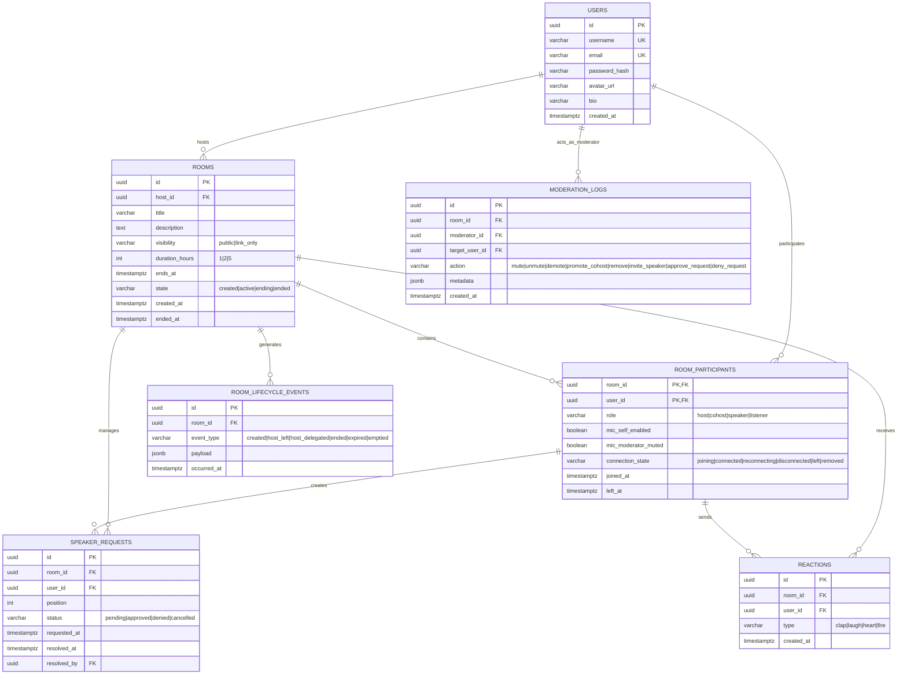
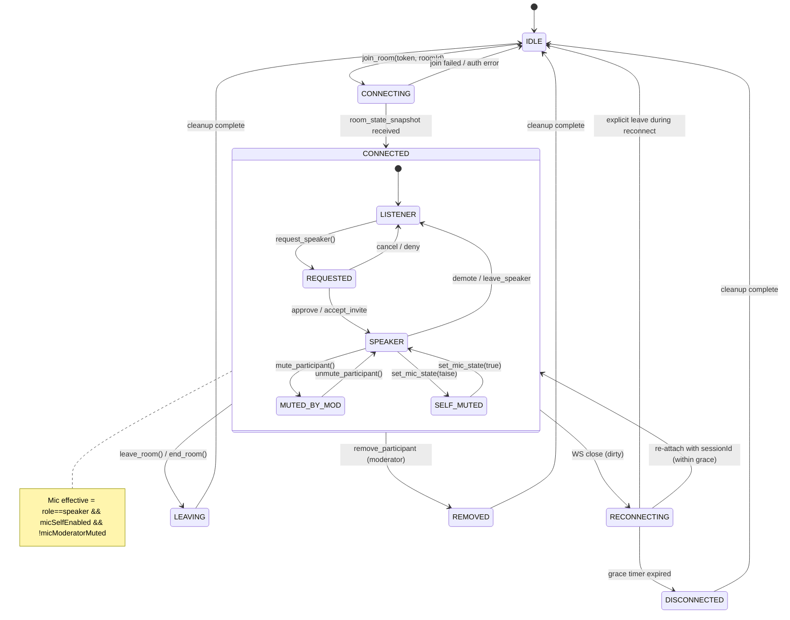

# 🎯 ASR Huddle — Complete Implementation Readiness Package

All 9 source docs synthesized.

---

## 1. ERD (Mermaid + SQL)

### Mermaid


### SQL (PostgreSQL 16+)
```sql
-- 0001_init.sql
CREATE EXTENSION IF NOT EXISTS "pgcrypto";

CREATE TYPE user_role AS ENUM ('host', 'cohost', 'speaker', 'listener');
CREATE TYPE room_visibility AS ENUM ('public', 'link_only');
CREATE TYPE room_state AS ENUM ('created', 'active', 'ending', 'ended');
CREATE TYPE connection_state AS ENUM ('joining', 'connected', 'reconnecting', 'disconnected', 'left', 'removed');
CREATE TYPE request_status AS ENUM ('pending', 'approved', 'denied', 'cancelled');
CREATE TYPE lifecycle_event AS ENUM ('created', 'host_left', 'host_delegated', 'ended', 'expired', 'emptied');
CREATE TYPE moderation_action AS ENUM ('mute', 'unmute', 'demote', 'promote_cohost', 'remove', 'invite_speaker', 'approve_request', 'deny_request');

CREATE TABLE users (
    id           uuid PRIMARY KEY DEFAULT gen_random_uuid(),
    username     varchar(50) UNIQUE NOT NULL,
    email        varchar(255) UNIQUE NOT NULL,
    password_hash varchar(255) NOT NULL,
    avatar_url   varchar(500),
    bio          varchar(280),
    created_at   timestamptz NOT NULL DEFAULT now()
);

CREATE INDEX idx_users_username ON users(username);
CREATE INDEX idx_users_email ON users(email);

CREATE TABLE rooms (
    id              uuid PRIMARY KEY DEFAULT gen_random_uuid(),
    host_id         uuid NOT NULL REFERENCES users(id),
    title           varchar(100) NOT NULL,
    description     text,
    visibility      room_visibility NOT NULL DEFAULT 'public',
    duration_hours  int NOT NULL CHECK (duration_hours IN (1,2,5)),
    ends_at         timestamptz NOT NULL,
    state           room_state NOT NULL DEFAULT 'created',
    created_at      timestamptz NOT NULL DEFAULT now(),
    ended_at        timestamptz
);

CREATE INDEX idx_rooms_host ON rooms(host_id);
CREATE INDEX idx_rooms_state_ends ON rooms(state, ends_at) WHERE state IN ('created', 'active');
CREATE INDEX idx_rooms_visibility ON rooms(visibility) WHERE state = 'active';

CREATE TABLE room_participants (
    room_id                 uuid NOT NULL REFERENCES rooms(id) ON DELETE CASCADE,
    user_id                 uuid NOT NULL REFERENCES users(id) ON DELETE CASCADE,
    role                    user_role NOT NULL DEFAULT 'listener',
    mic_self_enabled        boolean NOT NULL DEFAULT false,
    mic_moderator_muted     boolean NOT NULL DEFAULT false,
    connection_state        connection_state NOT NULL DEFAULT 'joining',
    joined_at               timestamptz NOT NULL DEFAULT now(),
    left_at                 timestamptz,
    PRIMARY KEY (room_id, user_id)
);

CREATE INDEX idx_rp_user ON room_participants(user_id);
CREATE INDEX idx_rp_role ON room_participants(role);
CREATE INDEX idx_rp_conn_state ON room_participants(connection_state);

CREATE TABLE room_lifecycle_events (
    id          uuid PRIMARY KEY DEFAULT gen_random_uuid(),
    room_id     uuid NOT NULL REFERENCES rooms(id) ON DELETE CASCADE,
    event_type  lifecycle_event NOT NULL,
    payload     jsonb NOT NULL DEFAULT '{}',
    occurred_at timestamptz NOT NULL DEFAULT now()
);

CREATE INDEX idx_rle_room_time ON room_lifecycle_events(room_id, occurred_at DESC);

CREATE TABLE speaker_requests (
    id           uuid PRIMARY KEY DEFAULT gen_random_uuid(),
    room_id      uuid NOT NULL REFERENCES rooms(id) ON DELETE CASCADE,
    user_id      uuid NOT NULL REFERENCES users(id) ON DELETE CASCADE,
    position     int NOT NULL,
    status       request_status NOT NULL DEFAULT 'pending',
    requested_at timestamptz NOT NULL DEFAULT now(),
    resolved_at  timestamptz,
    resolved_by  uuid REFERENCES users(id)
);

CREATE UNIQUE INDEX uq_sr_room_user_pending ON speaker_requests(room_id, user_id) WHERE status = 'pending';
CREATE INDEX idx_sr_room_status_pos ON speaker_requests(room_id, status, position);

CREATE TABLE reactions (
    id        uuid PRIMARY KEY DEFAULT gen_random_uuid(),
    room_id   uuid NOT NULL REFERENCES rooms(id) ON DELETE CASCADE,
    user_id   uuid NOT NULL REFERENCES users(id) ON DELETE CASCADE,
    type      varchar(20) NOT NULL CHECK (type IN ('clap','laugh','heart','fire')),
    created_at timestamptz NOT NULL DEFAULT now()
);

CREATE INDEX idx_reactions_room_time ON reactions(room_id, created_at DESC);
CREATE INDEX idx_reactions_user ON reactions(user_id);

CREATE TABLE moderation_logs (
    id              uuid PRIMARY KEY DEFAULT gen_random_uuid(),
    room_id         uuid NOT NULL REFERENCES rooms(id) ON DELETE CASCADE,
    moderator_id    uuid NOT NULL REFERENCES users(id),
    target_user_id  uuid NOT NULL REFERENCES users(id),
    action          moderation_action NOT NULL,
    metadata        jsonb NOT NULL DEFAULT '{}',
    created_at      timestamptz NOT NULL DEFAULT now()
);

CREATE INDEX idx_ml_room_time ON moderation_logs(room_id, created_at DESC);
CREATE INDEX idx_ml_moderator ON moderation_logs(moderator_id);
```

### Migration Order
```
0001_init.sql          -- tables, enums, indexes
0002_rls_policies.sql  -- row-level security (optional, for multi-tenant later)
0003_functions.sql     -- helper fns: promote_oldest_speaker(), end_expired_rooms()
```

---

## 2. Redis Data Model

### Key Patterns & TTLs
| Key | Type | TTL | Purpose |
|-----|------|-----|---------|
| `session:{sessionId}` | Hash | 30d (refresh on activity) | Live connection state |
| `room:{roomId}:meta` | Hash | 30d | Cached room config (title, visibility, ends_at) |
| `room:{roomId}:participants` | Set | 30d | Active `userId`s in room |
| `room:{roomId}:producers` | Hash | 30d | `userId` → `producerId` (active speakers) |
| `room:{roomId}:cohosts` | Set | 30d | `userId`s with cohost role |
| `room:{roomId}:speakers` | Sorted Set | 30d | `userId` (score = joined_at) for promotion ordering |
| `room:{roomId}:requests` | Sorted Set | 30d | `requestId` (score = position) for queue ordering |
| `room:{roomId}:request:{requestId}` | Hash | 30d | Request detail (userId, status) |
| `user:{userId}:active_session` | String | 24h | `sessionId` for single-session enforcement |
| `session:{sessionId}:grace_timer` | String | 30s | Timer handle / expiry epoch for reconnection grace |
| `lock:room:{roomId}:promote` | String | 5s | Distributed lock for host delegation |
| `lock:user:{userId}:join` | String | 5s | Distributed lock for single-session check |

### Session Hash Fields (`session:{sessionId}`)
```json
{
  "userId": "uuid",
  "roomId": "uuid",
  "role": "host|cohost|speaker|listener",
  "connectionState": "connected|reconnecting",
  "sendTransportId": "tp_send_xxx",
  "recvTransportId": "tp_recv_xxx",
  "producerId": "prod_audio_xxx",
  "wsNodeId": "worker-1",
  "createdAt": "ISO8601",
  "lastActivity": "ISO8601"
}
```

### Atomic Lua Scripts (run via `EVALSHA`)

#### `atomic_join_room.lua` — Single-session + capacity + role assignment
```lua
-- KEYS: [1]=user_active_session, [2]=room_participants, [3]=room_speakers, [4]=room_cohosts, [5]=room_meta
-- ARGV: [1]=userId, [2]=sessionId, [3]=roomId, [4]=maxSpeakers, [5]=maxListeners, [6]=maxCohosts, [7]=nowISO
local userKey = KEYS[1]
local existing = redis.call('GET', userKey)
if existing then return {err='SESSION_CONFLICT', existingSession=existing} end

local roomParticipants = redis.call('SCARD', KEYS[2])
local maxTotal = tonumber(ARGV[4]) + tonumber(ARGV[5])
if roomParticipants >= maxTotal then return {err='ROOM_FULL'} end

local isFirst = (roomParticipants == 0)
local role = isFirst and 'host' or 'listener'

redis.call('SET', userKey, ARGV[2], 'EX', 86400)
redis.call('SADD', KEYS[2], ARGV[1])
redis.call('HSET', 'session:'..ARGV[2], 'userId', ARGV[1], 'roomId', ARGV[3], 'role', role, 'connectionState', 'connected', 'createdAt', ARGV[7])

if isFirst then
  redis.call('SADD', KEYS[4], ARGV[1])
end

return {role=role, isFirst=isFirst}
```

#### `atomic_promote_cohost.lua` — Host delegation (called on unclean host disconnect)
```lua
-- KEYS: [1]=room_participants, [2]=room_speakers, [3]=room_cohosts, [4]=session_hash_prefix
-- ARGV: [1]=roomId, [2]=oldHostId, [3]=nowISO
local lock = 'lock:room:'..ARGV[1]..':promote'
if redis.call('SET', lock, '1', 'NX', 'EX', 5) == false then return {err='LOCK_BUSY'} end

local speakers = redis.call('ZRANGE', KEYS[2], 0, 0) -- oldest speaker
local newCohostId = speakers[1]
if not newCohostId then
  local listeners = redis.call('ZRANGE', KEYS[1], 0, 0) -- fallback oldest participant
  newCohostId = listeners[1]
end

if newCohostId then
  redis.call('ZADD', KEYS[3], ARGV[3], newCohostId)
  redis.call('HSET', KEYS[4]..':'..newCohostId, 'role', 'cohost')
  redis.call('PUBLISH', 'room:'..ARGV[1]..':events', cjson.encode({type='cohost_promoted', userId=newCohostId}))
end

redis.call('DEL', lock)
return {promoted=newCohostId}
```

#### `atomic_leave_room.lua` — Clean leave (intentional)
```lua
-- KEYS: [1]=user_active_session, [2]=room_participants, [3]=room_speakers, [4]=room_cohosts, [5]=room_requests, [6]=session_hash
-- ARGV: [1]=userId, [2]=sessionId, [3]=roomId
redis.call('DEL', KEYS[1])
redis.call('SREM', KEYS[2], ARGV[1])
redis.call('ZREM', KEYS[3], ARGV[1])
redis.call('ZREM', KEYS[4], ARGV[1])
-- cancel pending request
local reqs = redis.call('ZRANGE', KEYS[5], 0, -1)
for _, r in ipairs(reqs) do
  local uid = redis.call('HGET', 'room:'..ARGV[3]..':request:'..r, 'userId')
  if uid == ARGV[1] then
    redis.call('ZREM', KEYS[5], r)
    redis.call('DEL', 'room:'..ARGV[3]..':request:'..r)
    break
  end
end
redis.call('DEL', KEYS[6])
return {ok=true}
```

---

## 3. API Contracts

### 3.1 REST (OpenAPI 3.1 / TypeScript)

```typescript
// openapi.yaml (excerpt)
openapi: 3.1.0
info:
  title: ASR Huddle API
  version: 1.0.0
servers:
  - url: https://api.asrhuddle.dev/v1
paths:
  /auth/login:
    post:
      summary: Authenticate user, return JWT
      requestBody:
        content:
          application/json:
            schema:
              type: object
              required: [email, password]
              properties:
                email: {type: string, format: email}
                password: {type: string, format: password}
      responses:
        '200':
          description: OK
          content:
            application/json:
              schema:
                type: object
                properties:
                  accessToken: {type: string}
                  user: {$ref: '#/components/schemas/User'}
  /rooms:
    post:
      summary: Create room (auth required)
      security: [{bearerAuth: []}]
      requestBody:
        content:
          application/json:
            schema:
              type: object
              required: [title, durationHours, visibility]
              properties:
                title: {type: string, maxLength: 100}
                description: {type: string, maxLength: 500}
                durationHours: {type: integer, enum: [1,2,5]}
                visibility: {type: string, enum: [public, link_only]}
      responses:
        '201':
          content:
            application/json:
              schema: {$ref: '#/components/schemas/Room'}
    get:
      summary: List active public rooms
      security: [{bearerAuth: []}]
      parameters:
        - name: cursor
          in: query
          schema: {type: string}
        - name: limit
          in: query
          schema: {type: integer, default: 20, maximum: 50}
      responses:
        '200':
          content:
            application/json:
              schema:
                type: object
                properties:
                  rooms: {type: array, items: {$ref: '#/components/schemas/RoomSummary'}}
                  nextCursor: {type: string}
  /rooms/{roomId}:
    get:
      summary: Get room metadata (for link-only join preview)
      parameters:
        - name: roomId
          in: path
          required: true
          schema: {type: string, format: uuid}
      responses:
        '200':
          content:
            application/json:
              schema: {$ref: '#/components/schemas/Room'}
components:
  securitySchemes:
    bearerAuth:
      type: http
      scheme: bearer
  schemas:
    User:
      type: object
      properties:
        id: {type: string, format: uuid}
        username: {type: string}
        email: {type: string, format: email}
        avatarUrl: {type: string}
        bio: {type: string}
    Room:
      type: object
      properties:
        id: {type: string, format: uuid}
        hostId: {type: string, format: uuid}
        title: {type: string}
        description: {type: string}
        visibility: {type: string, enum: [public, link_only]}
        durationHours: {type: integer}
        endsAt: {type: string, format: date-time}
        state: {type: string, enum: [created, active, ending, ended]}
        createdAt: {type: string, format: date-time}
    RoomSummary:
      allOf:
        - $ref: '#/components/schemas/Room'
        - type: object
          properties:
            participantCount: {type: integer}
            speakerCount: {type: integer}
```

### 3.2 WS JSON-RPC 2.0 (Client ↔ Backend)

#### Connection
```
WS wss://api.asrhuddle.dev/v1/ws?token=<JWT>
```
*Heartbeat*: Client sends `{"jsonrpc":"2.0","method":"ping","id":<n>}` every 15s. Server replies `{"jsonrpc":"2.0","result":"pong","id":<n>}`.

#### Methods (Client → Server)

| Method | Params | Success Result | Errors |
|--------|--------|----------------|--------|
| `join_room` | `{roomId: string, sessionId?: string}` | `room_state_snapshot` | `ROOM_NOT_FOUND`, `ROOM_ENDED`, `ROOM_FULL`, `SESSION_CONFLICT`, `INVALID_SESSION` |
| `create_transport` | `{direction: "send"\|"recv"}` | `{id, iceParameters, iceCandidates, dtlsParameters}` | `FORBIDDEN` (send + not speaker/host), `TRANSPORT_EXISTS` |
| `produce` | `{transportId, kind:"audio", rtpParameters}` | `{producerId}` | `FORBIDDEN`, `TRANSPORT_NOT_FOUND`, `INVALID_RTP_PARAMETERS` |
| `consume` | `{transportId, producerId, rtpParameters}` | `{consumerId, producerId, kind, rtpParameters}` | `PRODUCER_NOT_FOUND`, `TRANSPORT_NOT_FOUND` |
| `request_speaker` | `{}` | `{requestId, position}` | `NOT_LISTENER`, `SPEAKER_CAPACITY_FULL`, `ALREADY_REQUESTED` |
| `cancel_speaker_request` | `{requestId}` | `{}` | `REQUEST_NOT_FOUND`, `NOT_OWNER` |
| `approve_speaker_request` | `{requestId}` | `{userId}` | `FORBIDDEN`, `REQUEST_NOT_FOUND`, `SPEAKER_CAPACITY_FULL` |
| `deny_speaker_request` | `{requestId}` | `{}` | `FORBIDDEN`, `REQUEST_NOT_FOUND` |
| `invite_speaker` | `{userId}` | `{}` | `FORBIDDEN`, `USER_NOT_IN_ROOM`, `SPEAKER_CAPACITY_FULL` |
| `accept_speaker_invite` | `{}` | `{}` | `NO_PENDING_INVITE`, `SPEAKER_CAPACITY_FULL` |
| `set_mic_state` | `{enabled: boolean}` | `{}` | `NOT_SPEAKER` |
| `mute_participant` | `{userId}` | `{}` | `FORBIDDEN`, `USER_NOT_FOUND`, `CANNOT_MUTE_HOST` |
| `unmute_participant` | `{userId}` | `{}` | `FORBIDDEN` |
| `demote_speaker` | `{userId}` | `{}` | `FORBIDDEN`, `NOT_SPEAKER` |
| `promote_cohost` | `{userId}` | `{}` | `FORBIDDEN`, `NOT_SPEAKER`, `COHOST_LIMIT_REACHED` |
| `remove_participant` | `{userId}` | `{}` | `FORBIDDEN`, `CANNOT_REMOVE_HOST` |
| `leave_room` | `{}` | `{}` | — |
| `end_room` | `{}` | `{}` | `NOT_HOST` |
| `send_reaction` | `{type: "clap"\|"laugh"\|"heart"\|"fire"}` | `{}` | `RATE_LIMITED` |

#### Notifications (Server → Client, no `id`)

| Method | Params | Description |
|--------|--------|-------------|
| `room_state_snapshot` | `{roomId, userRole, routerRtpCapabilities, participants: [{userId, peerId, role, isMuted, producerId}]}` | Sent on successful join/rejoin |
| `participant_joined` | `{userId, peerId, role, isMuted, producerId?}` | New participant |
| `participant_left` | `{userId, reason: "left"\|"removed"\|"disconnected"}` | Participant gone |
| `participant_updated` | `{userId, role?, isMuted?, connectionState?}` | Role/mic/connection change |
| `speaker_request_created` | `{requestId, userId, position}` | Queue update |
| `speaker_request_resolved` | `{requestId, status: "approved"\|"denied"\|"cancelled", userId}` | Queue update |
| `speaker_invited` | `{inviterId}` | Sent to invitee |
| `active_speakers` | `{speakers: [{producerId, volume}]}` | VAD output (throttled 500ms) |
| `reaction_received` | `{userId, type}` | Reaction broadcast |
| `session_restored` | `{}` | Reconnection success |
| `room_ending` | `{reason: "host_ended"\|"timer_expired"\|"empty", endsInMs: 300000}` | 5-min warning / immediate |
| `room_ended` | `{}` | Final cleanup |
| `error` | `{code, message, data?}` | Async error (e.g., produce failed) |

#### JSON-RPC Error Codes
| Code | Message | Meaning |
|------|---------|---------|
| -32600 | Invalid Request | Malformed JSON-RPC |
| -32601 | Method not found | Unknown method |
| -32602 | Invalid params | Params schema violation |
| -32603 | Internal error | Server bug |
| -32000 | Unauthorized | Invalid/expired JWT |
| -32001 | Forbidden | Role doesn't permit action |
| -32002 | Room not found | Room ID unknown or ended |
| -32003 | Room full | Capacity reached |
| -32004 | Session conflict | User already in a room |
| -32005 | Invalid session | Reconnect sessionId expired |
| -32006 | Transport not found | Transport ID unknown |
| -32007 | Producer not found | Producer ID unknown |
| -32008 | Request not found | Speaker request ID unknown |
| -32009 | Capacity full | Speaker/cohost limit reached |
| -32010 | Rate limited | Too many requests |
| -32011 | Cannot mute host | Host immune to mute |
| -32012 | Cannot remove host | Host immune to remove |

---

### 3.3 SFU Integration API (Backend ↔ Mediasoup)

Internal Node.js module (not HTTP). Called by Room Orchestrator.

```typescript
// mediasoup-adapter.ts
interface SFUAdapter {
  // Room lifecycle
  createRoom(roomId: string, workerId: string): Promise<Router>
  closeRoom(roomId: string): Promise<void>
  getRouter(roomId: string): Router | undefined

  // Transport
  createWebRtcTransport(roomId: string, direction: 'send'|'recv', dtlsParameters?: DtlsParameters): Promise<{
    id: string
    iceParameters: IceParameters
    iceCandidates: IceCandidate[]
    dtlsParameters: DtlsParameters
  }>
  connectTransport(roomId: string, transportId: string, dtlsParameters: DtlsParameters): Promise<void>

  // Producer
  produce(roomId: string, transportId: string, kind: 'audio', rtpParameters: RtpParameters, appData: {userId: string}): Promise<{
    producerId: string
    rtpParameters: RtpParameters
  }>
  closeProducer(roomId: string, producerId: string): Promise<void>
  pauseProducer(roomId: string, producerId: string): Promise<void>
  resumeProducer(roomId: string, producerId: string): Promise<void>

  // Consumer
  consume(roomId: string, transportId: string, producerId: string, rtpCapabilities: RtpCapabilities, appData: {userId: string}): Promise<{
    consumerId: string
    producerId: string
    kind: 'audio'
    rtpParameters: RtpParameters
  }>
  closeConsumer(roomId: string, consumerId: string): Promise<void>
  setConsumerPreferredLayers(roomId: string, consumerId: string, spatialLayer: number, temporalLayer: number): Promise<void>

  // Stats
  getProducerStats(roomId: string, producerId: string): Promise<RtpStatistics[]>
  getConsumerStats(roomId: string, consumerId: string): Promise<RtpStatistics[]>
  getTransportStats(roomId: string, transportId: string): Promise<TransportStatistics>

  // VAD
  addProducerToAudioLevelObserver(roomId: string, producerId: string): Promise<void>
  removeProducerFromAudioLevelObserver(roomId: string, producerId: string): Promise<void>
  onAudioLevelObserverVolumes(roomId: string, callback: (volumes: {producerId: string, volume: number}[]) => void): void

  // ASR Ingestion (PlainTransport)
  createPlainTransportForASR(roomId: string, rtcpMux: boolean, comedia: boolean): Promise<{
    transportId: string
    ip: string
    port: number
    rtcpPort: number
  }>
  connectPlainTransport(roomId: string, transportId: string, ip: string, port: number, rtcpPort: number): Promise<void>
}
```

---

## 4. Participant State Machine

### Mermaid


### Mic Privacy States (orthogonal to role)
| Role | `micSelfEnabled` | `micModeratorMuted` | **Effective Publishing** |
|------|------------------|---------------------|--------------------------|
| Listener | false | false | ❌ |
| Speaker | true | false | ✅ |
| Speaker | false | false | ❌ (self-muted) |
| Speaker | true | true | ❌ (moderator-muted) |
| Speaker | false | true | ❌ (both) |
| Co-host | same as Speaker | same | same |
| Host | same as Speaker | same | same |

---

## 5. Audio Wire Spec

| Parameter | Value | Source |
|-----------|-------|--------|
| **Codec** | Opus | Mandatory WebRTC |
| **Sample Rate** | 48 kHz | Capture + Opus native |
| **Channels** | 1 (mono) | `stereo=0`, Scope: voice only |
| **Frame Duration (`ptime`)** | **10 ms** (preferred) / 20 ms fallback | Research: -10ms algorithmic delay |
| **Minptime** | 10 | SDP `minptime=10` |
| **Max Average Bitrate** | **32,000 bps** (32 kbps) | Research: transparent mono voice |
| **In-Band FEC** | **Enabled** (`useinbandfec=1`) | Research: packet loss recovery |
| **DTX** | **Enabled** (`usedtx=1`) | Research: silence suppression |
| **CBR** | Disabled (`cbr=0`) | VBR adapts to voice |
| **Sprop Max Capture Rate** | 48000 | Matches capture |
| **RTP Extensions** | `urn:ietf:params:rtp-hdr-ext:ssrc-audio-level`<br>`urn:ietf:params:rtp-hdr-ext:sdes:mid`<br>`urn:ietf:params:rtp-hdr-ext:sdes:rid`<br>`http://www.webrtc.org/experiments/rtp-hdr-ext/abs-send-time`<br>`http://www.ietf.org/id/draft-holmer-rmcat-transport-wide-cc-extensions-01` | Volume, simulcast, sync, congestion control |
| **ICE Candidate Policy** | `all` (gather host, srflx, relay) | Production TURN required |
| **ICE Transport Policy** | `relay` optional (force TURN for privacy) | Configurable |
| **DTLS Role** | `auto` | Standard |
| **SRTP Profile** | `SAES_CM_128_HMAC_SHA1_80` | Standard |
| **Opus Payload Type** | 111 (dynamic) | SDP negotiation |
| **Client Capture Constraints** | `{echoCancellation:true, noiseSuppression:true, autoGainControl:true, sampleRate:48000, channelCount:1}` | Research §1.1, §1.4 |
| **Sender Parameters** | `maxBitrate: 32000`, `priority: 'high'`, `networkPriority: 'high'` | Research §2.3, §3.2 |
| **Telemetry Interval** | 500 ms (VAD), 1000 ms (getStats) | Research §5.6 |
| **Jitter Buffer Alert Threshold** | `avgDelay > 1.5 * ptime` | Research §1.9 |

### SDP Munging Function (Client & Server)
```typescript
function applyOpusBaselineSDP(sdp: string): string {
  const opusFmtpRegex = /a=fmtp:(\d+)\s+(.*)/;
  const match = sdp.match(opusFmtpRegex);
  if (!match) return sdp;
  const pt = match[1];
  const tuned = `a=fmtp:${pt} minptime=10;ptime=10;maxaveragebitrate=32000;useinbandfec=1;usedtx=1;stereo=0;sprop-maxcapturerate=48000`;
  return sdp.replace(opusFmtpRegex, tuned);
}
```

---

## 6. Refined Stage-Map (Vertical Slices M0 → M6)

| Slice | Name | Scope (Vertical) | Definition of Done | PoC Coverage | Key Risks |
|-------|------|------------------|---------------------|--------------|-----------|
| **M0** | **Walking Skeleton** | Repo, CI, Docker Compose (Postgres, Redis, Mediasoup, Backend, Frontend), Healthchecks, Auth stub (JWT), Empty WS server, SFU process starts | `docker compose up` → all green, `GET /healthz` 200, WS connects, Mediasoup worker logs "running" | PoC 2 (worker init) | Mediasoup version/Node compatibility |
| **M1** | **Auth & Room CRUD** | `POST /auth/login`, `POST /rooms`, `GET /rooms/active`, `GET /rooms/:id`, JWT middleware, Room lifecycle (create→active→ended), Duration timer, Empty room cleanup | User creates room via API, sees it in list, room auto-ends after duration, 5-min warning logged | — | Timer accuracy, clock sync |
| **M2** | **Join/Leave + Presence** | `join_room` / `leave_room` WS RPC, Redis session + participant sets, Single-session lock, `room_state_snapshot` (no producers yet), `participant_joined/left` notifications | Two tabs (different users) join same room, see each other in UI, leave cleans up Redis, duplicate tab rejected | PoC 1 (WS handshake), PoC 4 (session model) | Race conditions on join/leave |
| **M3** | **Listener Audio** | `create_transport(recv)`, `consume` for each active producer, 1 RecvTransport multiplexing, Client plays all tracks via `<audio>` elements, `active_speakers` VAD notifications | User A joins as listener, User B (speaker) talks → A hears audio, VAD UI updates | PoC 3 (SFU forwarding, RecvTransport, consume, getStats) | Client track management, autoplay policy |
| **M4** | **Speaker Publishing** | `create_transport(send)` (RBAC: speaker/host only), `produce`, Opus baseline params via `setParameters` + SDP munging, `mic_self_enabled` toggle, `mic_moderator_muted` enforcement | User raises hand → approved → enables mic → others hear them, self-mute works, host mute works | PoC 3 (produce, sendTransport), Research (Opus params) | Browser permissions, Opus param enforcement |
| **M5** | **Moderation & Queue** | Speaker request queue (raise/cancel/approve/deny), Direct invite, Demote, Promote cohost (max 5, speaker-first), Remove participant, Host leave silent (delegation), Host end room, Co-host permissions | Full moderation flow works: queue visible, host approves → speaker, host mutes → speaker silenced, host leaves → cohost takes over, host returns → both cohosts | PoC 4 (state machine), SDD (RBAC) | Concurrent moderation actions, promotion race |
| **M6** | **Reconnection & Hardening** | 15-30s grace window (transports held), Re-attach with `sessionId` → `session_restored`, Mic off after recovery, Network transition (WiFi→LTE), Browser refresh, Rate limiting, Structured logging, Prometheus metrics (`room_active`, `participant_connected`, `webrtc_publisher`, `sfu_cpu`), Load test 10/50 | Kill host WiFi → room lives, cohost promoted → host reconnects → both cohosts, speaker drops → reconnects in 10s → mic off, 50 listeners + 10 speakers sustained 30 min, CPU < 70%, p99 latency < 150ms | PoC 4 (grace window, re-attach), Research (latency budget) | Timer leaks, memory growth, TURN connectivity |

---

